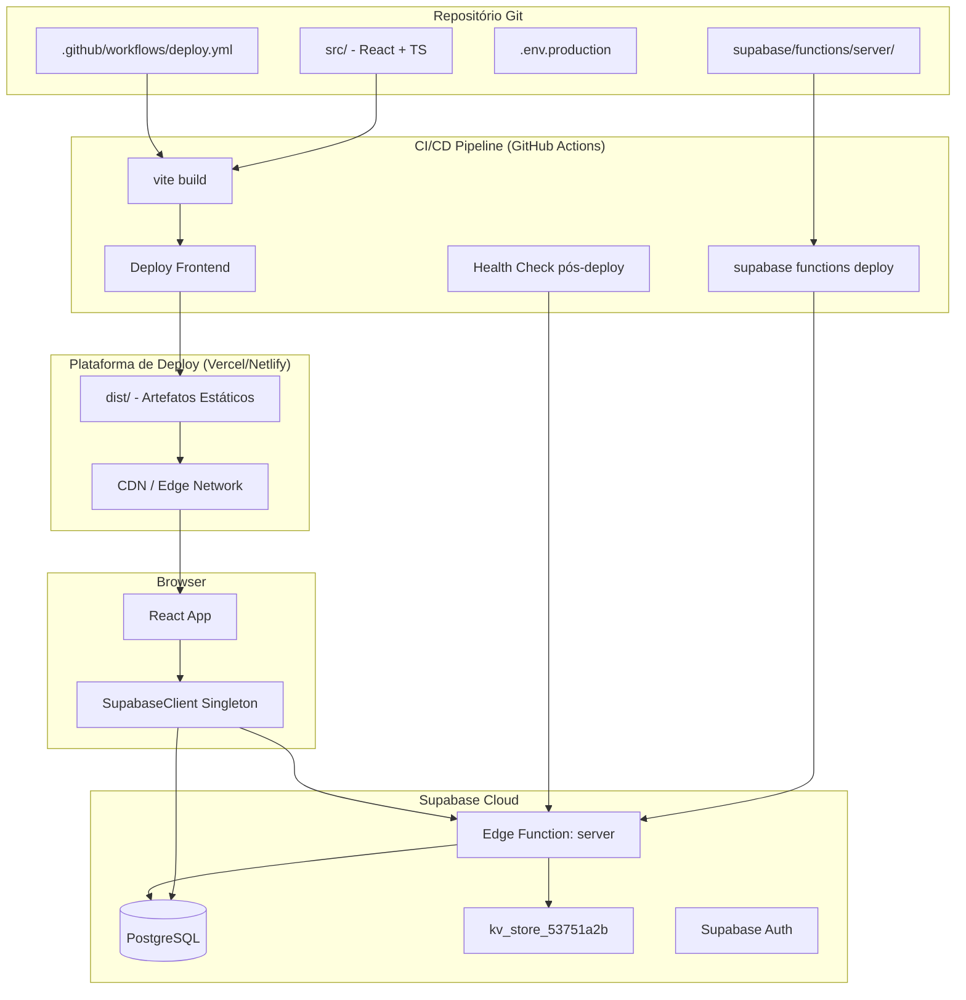
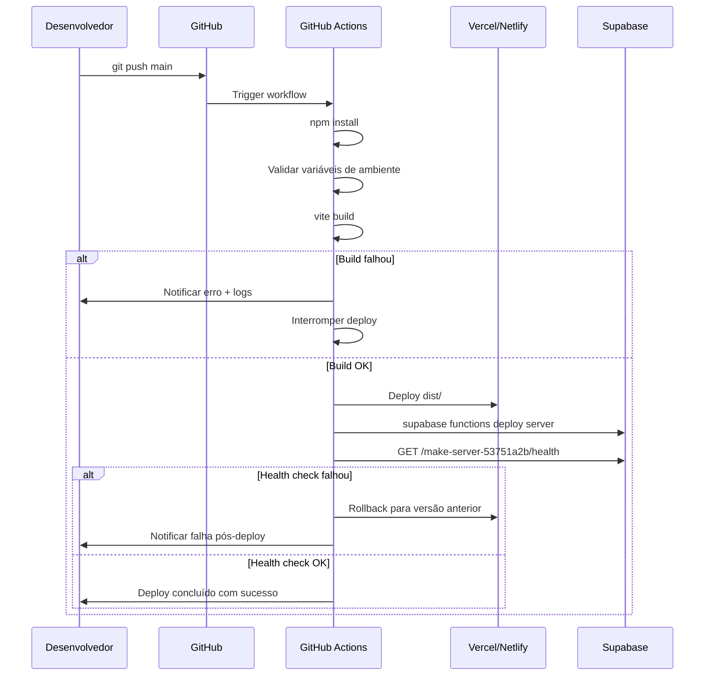

# Design Document

## Feature: system-deployment-database-connection

---

## Overview

Este documento descreve o design técnico para o processo de deploy em produção da aplicação React + TypeScript + Vite e a conexão ao banco de dados Supabase (PostgreSQL), incluindo as Edge Functions hospedadas no Supabase.

O projeto atual utiliza:
- **Frontend**: React 18 + TypeScript + Vite 6, com ofuscação via `rollup-plugin-obfuscator`
- **Backend**: Supabase Edge Functions (Deno) em `supabase/functions/server/`, usando Hono como framework HTTP
- **Banco de dados**: Supabase PostgreSQL, acessado via `@supabase/supabase-js`
- **Estado atual**: O `AppContext.tsx` usa `localStorage` como persistência — a integração com Supabase está presente apenas nas Edge Functions via `kv_store.tsx`

O design cobre três eixos principais:
1. **Build e configuração de variáveis de ambiente** — garantir que o frontend seja construído corretamente com credenciais seguras
2. **Conexão ao Supabase** — criar um cliente singleton seguro no frontend
3. **Deploy e CI/CD** — automatizar o processo de publicação do frontend e das Edge Functions

---

## Architecture



### Fluxo de Deploy



---

## Components and Interfaces

### 1. Módulo de Configuração de Ambiente (`src/lib/env.ts`)

Responsável por validar e expor as variáveis de ambiente do Vite de forma segura.

```typescript
interface EnvConfig {
  supabaseUrl: string;
  supabaseAnonKey: string;
}

function validateEnv(): EnvConfig
```

- Lê `import.meta.env.VITE_SUPABASE_URL` e `import.meta.env.VITE_SUPABASE_ANON_KEY`
- Lança erro descritivo listando variáveis ausentes se alguma não estiver definida
- Exporta objeto imutável com as configurações validadas

### 2. Cliente Supabase Singleton (`src/lib/supabaseClient.ts`)

Instância única do cliente Supabase reutilizada em toda a aplicação.

```typescript
import { createClient, SupabaseClient } from '@supabase/supabase-js'

let instance: SupabaseClient | null = null

function getSupabaseClient(): SupabaseClient
```

- Padrão singleton: cria o cliente na primeira chamada, reutiliza nas subsequentes
- Usa as credenciais validadas pelo módulo `env.ts`
- Exporta função `getSupabaseClient()` como interface pública

### 3. Edge Function (`supabase/functions/server/index.tsx`)

Já existente. Expõe:
- `GET /make-server-53751a2b/health` → `{ status: "ok" }` com HTTP 200
- CORS configurado com `origin: "*"` (a ser restringido para a URL de produção)
- Tratamento de erros 5xx com corpo JSON descritivo

### 4. Pipeline CI/CD (`.github/workflows/deploy.yml`)

Workflow GitHub Actions com os seguintes jobs:
- `build`: instala dependências, valida env vars, executa `vite build`
- `deploy-frontend`: publica `dist/` na plataforma de deploy
- `deploy-functions`: executa `supabase functions deploy server`
- `health-check`: verifica o endpoint de health após deploy
- `rollback`: acionado em caso de falha no health check

### 5. Script de Validação de Build (`scripts/validate-env.ts`)

Script executado como pré-build para verificar variáveis obrigatórias:

```typescript
const REQUIRED_VARS = ['VITE_SUPABASE_URL', 'VITE_SUPABASE_ANON_KEY']

function validateBuildEnv(): void
// Lança processo com exit code 1 e mensagem descritiva se variável ausente
```

---

## Data Models

### Variáveis de Ambiente

| Variável | Escopo | Descrição |
|---|---|---|
| `VITE_SUPABASE_URL` | Frontend (build-time) | URL do projeto Supabase (`https://<project-id>.supabase.co`) |
| `VITE_SUPABASE_ANON_KEY` | Frontend (build-time) | Chave pública anon do Supabase |
| `SUPABASE_URL` | Edge Function (runtime) | URL do projeto (injetada automaticamente pelo Supabase) |
| `SUPABASE_SERVICE_ROLE_KEY` | Edge Function (runtime) | Chave de serviço (injetada automaticamente pelo Supabase) |
| `SUPABASE_ACCESS_TOKEN` | CI/CD | Token para autenticação no Supabase CLI |
| `VERCEL_TOKEN` / `NETLIFY_AUTH_TOKEN` | CI/CD | Token da plataforma de deploy |

> As variáveis `VITE_*` são embutidas no bundle pelo Vite em build-time. As variáveis sem prefixo `VITE_` nunca chegam ao browser.

### Objeto de Erro Estruturado

Retornado pelo wrapper do cliente Supabase em caso de falha:

```typescript
interface SupabaseError {
  code: string;       // Código de erro (ex: "CONNECTION_FAILED")
  message: string;    // Mensagem amigável para o usuário
  timestamp: string;  // ISO 8601
}
```

### Resposta de Health Check

```typescript
interface HealthCheckResponse {
  status: "ok";
}
```

### Resposta de Erro da Edge Function (5xx)

```typescript
interface EdgeFunctionError {
  error: string;      // Mensagem descritiva do erro
  code?: number;      // Código HTTP opcional
}
```

---

## Correctness Properties

*A property is a characteristic or behavior that should hold true across all valid executions of a system — essentially, a formal statement about what the system should do. Properties serve as the bridge between human-readable specifications and machine-verifiable correctness guarantees.*

### Property 1: Leitura de credenciais a partir de variáveis de ambiente

*Para qualquer* par de valores `(VITE_SUPABASE_URL, VITE_SUPABASE_ANON_KEY)` fornecidos como variáveis de ambiente, o cliente Supabase criado por `getSupabaseClient()` deve ser inicializado exatamente com esses valores — nunca com valores hardcoded.

**Validates: Requirements 2.1**

---

### Property 2: Validação de variáveis ausentes

*Para qualquer* subconjunto não-vazio de variáveis de ambiente obrigatórias que esteja ausente, a função `validateEnv()` deve lançar um erro cujo texto menciona explicitamente o nome de cada variável ausente.

**Validates: Requirements 2.2, 2.3**

---

### Property 3: Tratamento de erros do cliente Supabase

*Para qualquer* erro retornado pelo Supabase (falha de rede, credenciais inválidas, timeout), o wrapper do cliente deve retornar um objeto `SupabaseError` estruturado que não contém stack traces, mensagens internas do Supabase ou detalhes de implementação.

**Validates: Requirements 3.3**

---

### Property 4: Singleton do cliente Supabase

*Para qualquer* número de chamadas à função `getSupabaseClient()` dentro do mesmo contexto de execução, todas as chamadas devem retornar a mesma referência de objeto (identidade referencial).

**Validates: Requirements 3.4**

---

### Property 5: Headers CORS para origens do frontend

*Para qualquer* requisição HTTP à Edge Function originada de uma URL válida do frontend publicado, a resposta deve conter o header `Access-Control-Allow-Origin` com valor que permita essa origem.

**Validates: Requirements 4.3**

---

### Property 6: Erros 5xx da Edge Function em formato JSON

*Para qualquer* erro interno que cause uma resposta HTTP 5xx na Edge Function, o corpo da resposta deve ser JSON válido contendo um campo `error` com mensagem descritiva não-vazia.

**Validates: Requirements 4.4**

---

## Error Handling

### Frontend — Inicialização do Cliente

```
validateEnv()
  ├── VITE_SUPABASE_URL ausente → throw Error("Variáveis de ambiente ausentes: VITE_SUPABASE_URL")
  ├── VITE_SUPABASE_ANON_KEY ausente → throw Error("Variáveis de ambiente ausentes: VITE_SUPABASE_ANON_KEY")
  └── Ambas ausentes → throw Error("Variáveis de ambiente ausentes: VITE_SUPABASE_URL, VITE_SUPABASE_ANON_KEY")
```

O erro é lançado em tempo de inicialização do módulo, antes de qualquer tentativa de conexão. Isso garante que a aplicação falhe rapidamente (fail-fast) com uma mensagem clara.

### Frontend — Requisições ao Supabase

Todas as chamadas ao Supabase devem ser encapsuladas para converter erros internos em `SupabaseError`:

```typescript
async function safeQuery<T>(fn: () => Promise<{ data: T | null; error: unknown }>): Promise<{ data: T | null; error: SupabaseError | null }>
```

- Erros de rede → `{ code: "NETWORK_ERROR", message: "Falha na conexão. Tente novamente." }`
- Erros de autenticação → `{ code: "AUTH_ERROR", message: "Sessão expirada. Faça login novamente." }`
- Erros genéricos → `{ code: "UNKNOWN_ERROR", message: "Ocorreu um erro inesperado." }`

### Edge Function — Tratamento Global de Erros

O Hono suporta middleware de tratamento de erros global:

```typescript
app.onError((err, c) => {
  console.error(err);
  return c.json({ error: err.message || "Erro interno do servidor" }, 500);
});
```

### CI/CD — Falhas de Deploy

- Build falhou → pipeline para, notifica via GitHub Actions summary, não faz deploy
- Health check falhou → aciona rollback na plataforma de deploy, notifica desenvolvedor
- Deploy de Edge Function falhou → pipeline para, versão anterior permanece ativa

---

## Testing Strategy

### Avaliação de PBT

Este feature envolve lógica pura testável (validação de env vars, singleton, tratamento de erros, CORS) além de integrações com serviços externos. PBT é aplicável para as propriedades de lógica pura; testes de integração cobrem os serviços externos.

### Biblioteca de PBT

**[fast-check](https://github.com/dubzzz/fast-check)** — biblioteca de property-based testing para TypeScript/JavaScript, amplamente adotada no ecossistema.

### Testes de Propriedade (Property-Based Tests)

Cada teste deve rodar com mínimo de **100 iterações**.

**Property 1 — Leitura de credenciais**
```
Feature: system-deployment-database-connection, Property 1: client uses env var values
```
Gerar pares aleatórios de (url, anonKey) como strings, mockar `import.meta.env`, verificar que o cliente criado usa exatamente esses valores.

**Property 2 — Validação de variáveis ausentes**
```
Feature: system-deployment-database-connection, Property 2: missing vars produce descriptive error
```
Gerar subconjuntos aleatórios das variáveis obrigatórias para omitir, verificar que o erro menciona cada variável ausente.

**Property 3 — Tratamento de erros estruturado**
```
Feature: system-deployment-database-connection, Property 3: errors are sanitized
```
Gerar erros aleatórios (mensagens, stack traces, objetos de erro do Supabase), verificar que o resultado é sempre um `SupabaseError` sem dados internos.

**Property 4 — Singleton**
```
Feature: system-deployment-database-connection, Property 4: singleton identity
```
Gerar número aleatório de chamadas (1–100) a `getSupabaseClient()`, verificar que todas retornam `===` a mesma referência.

**Property 5 — CORS**
```
Feature: system-deployment-database-connection, Property 5: CORS headers for valid origins
```
Gerar origens válidas do frontend (variações de URL de produção), verificar que a resposta contém `Access-Control-Allow-Origin` adequado.

**Property 6 — Erros 5xx em JSON**
```
Feature: system-deployment-database-connection, Property 6: 5xx errors are JSON with error field
```
Simular erros internos aleatórios na Edge Function, verificar que a resposta é JSON com campo `error` não-vazio.

### Testes de Exemplo (Example-Based Tests)

- Health check retorna `{ status: "ok" }` com HTTP 200 (Requirement 4.2, 6.2)
- Build sem variáveis de ambiente falha com exit code 1 (Requirement 2.2)
- Inicialização do cliente com credenciais válidas não lança exceção (Requirement 3.1)

### Testes de Integração

- Cliente Supabase conecta ao projeto real e executa query simples em até 5s (Requirement 3.2)
- Edge Function responde após deploy (Requirement 4.1)
- Aplicação retorna HTTP 200 na rota raiz após deploy (Requirement 6.1)
- Console sem erros após carregamento em produção (Requirement 6.3)

### Testes de Smoke (Pós-Deploy)

- `dist/` gerado sem arquivos `.map` (Requirement 1.3)
- Arquivos JS em `dist/` contêm código ofuscado (Requirement 1.2)
- Nenhuma chave hardcoded no código-fonte (Requirement 2.4)
- Pipeline CI/CD configurado com secrets corretos (Requirement 5.4)
- Rollback configurado na plataforma de deploy (Requirement 6.4)

### Balanceamento de Testes

- **Testes de propriedade**: cobrem a lógica pura com ampla variação de inputs
- **Testes de exemplo**: cobrem cenários específicos e casos de borda conhecidos
- **Testes de integração**: verificam a conectividade real com Supabase (executados em CI com credenciais de staging)
- **Smoke tests**: verificações pontuais de configuração e pós-deploy
